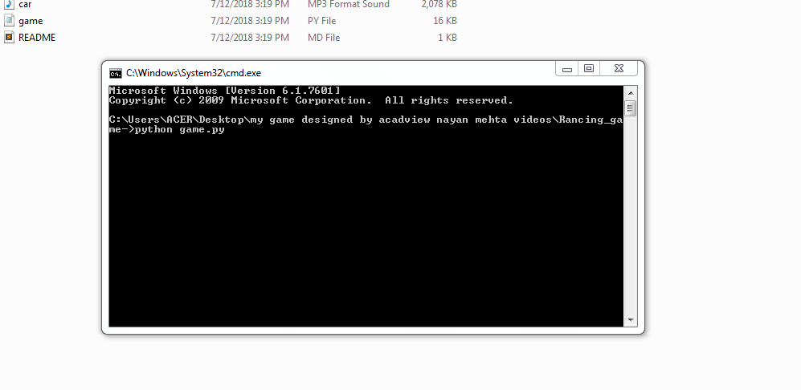
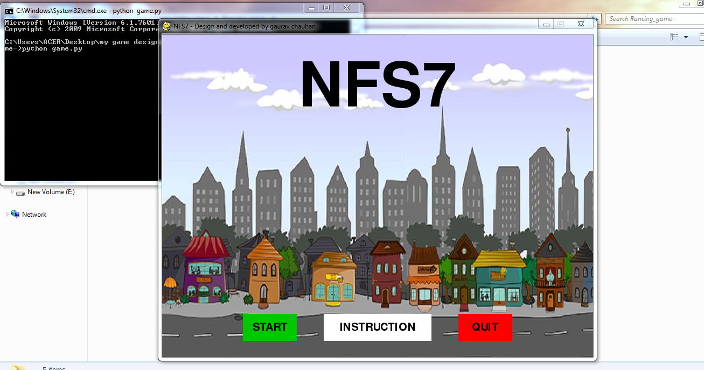
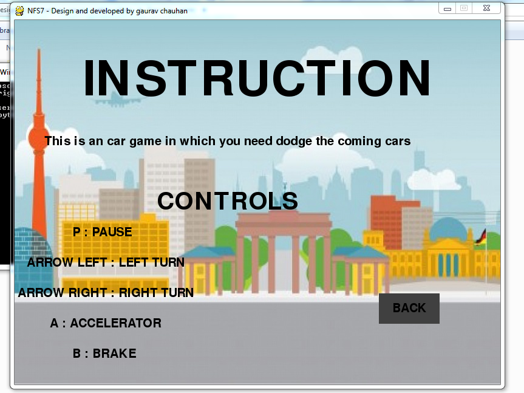
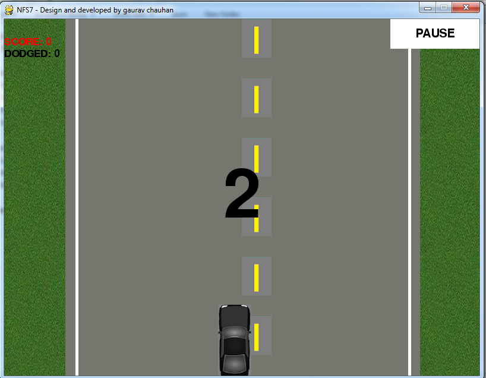
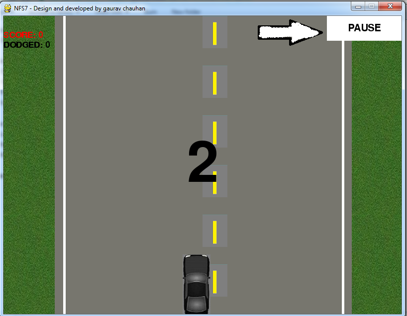
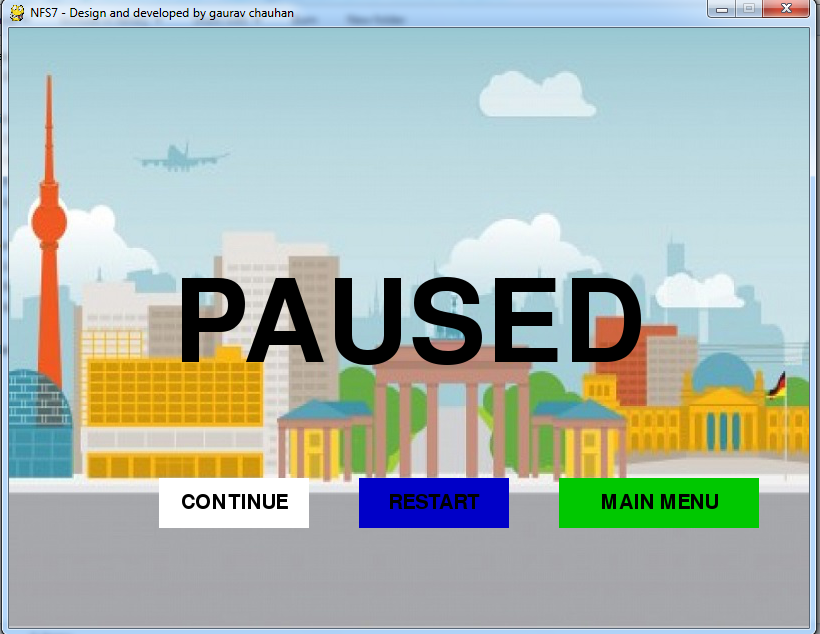

# Rancing_game-  

## Designed and developed by [Gaurav Chauhan](https://github.com/gaurav-210)

Game creation in any programming language is very rewarding, and also makes for a great teaching tool. With game development, you often have quite a bit of logic, mathematics, physics, artificial intelligence, and other things, all of which come together for game creation. Not only this, but the topic is games, so it can be very fun. Many times people like to visualize the programs they are creating, as it can help people to learn programming logic quickly. Games are fantastic for this, as your are specifically programming everything you see.

--------------------------------------------------------------------------------------
## WHAT THIS APPLICATION WILL DO ?
   This gaming application is a car game with animation effects in Python used to play game with cars and the objects.

* The game is simple car game where the player has to avoid obstacles to get points for each obstacle dodged.
* The game shows the score and asks for a option for replay when the player crashes his car.

-----------------------------------------------------------------------------------------
### The application is built using pygame library. It has the following components
* GUI
* Moving object
* Audio and sound effects

---------------------------------------------------------------------------------------------
### Objectives Achived
- [x] Simple GUI for the game window
- [x] Add the car icon in the game
- [x] Use sound and audio effects
- [x] Display score as the no of obstacles dodged
- [x] Replay options for the game to restart

----------------------------------------------------------------------------------------------------------
# Getting Started
### 1. The things you need to load the game up:
### 2. Matching PyGame version from pip.
### Download and install python 3.3+, make sure its on your PATH. Now install pygame!

    * pip install pygame                              

### To run interminal type :-python game.py

------------------------------------------------------------------------------------------------------

--------------------------------------------------------------------------------------------------------

### To start the game click on Start Button

 

----------------------------------------------------------------------------------------------------------

### To read the instruction of the game click on Instruction Button

 

--------------------------------------------------------------------------------------------------------

# finally the game begins........

 

--------------------------------------------------------------------------------------------

### If you want to pause the game you can click on paused button which is given on right top corner of the window  

----------------------------------------------------------------------------------------------------- 

### When you paused the game you have three choices...

#### 1. Continue
#### 2. Restart 
#### 3. Main Menu

------------------------------------------------------------------------------------------

                                                THANK YOU

### Special Thanks To 
     Acadview
     Aishwarya Sir
     Mukesh Dubey
     Rahul 

