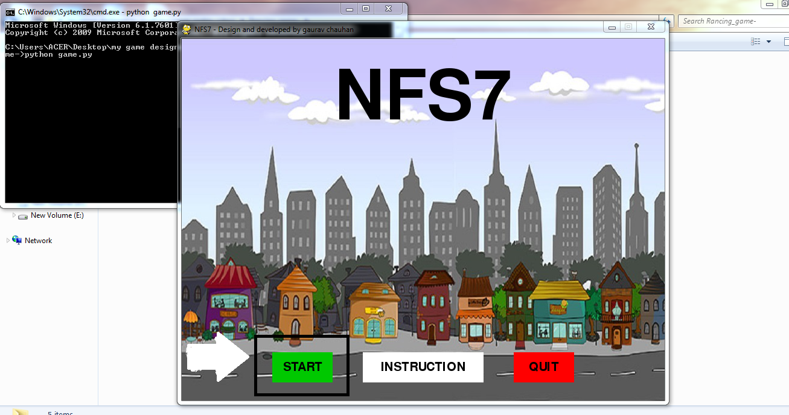

# Rancing_game-     [GitHub](https://github.com/gaurav-210)
Game creation in any programming language is very rewarding, and also makes for a great teaching tool. With game development, you often have quite a bit of logic, mathematics, physics, artificial intelligence, and other things, all of which come together for game creation. Not only this, but the topic is games, so it can be very fun. Many times people like to visualize the programs they are creating, as it can help people to learn programming logic quickly. Games are fantastic for this, as your are specifically programming everything you see.

----------------------------------------------------------------------------------------------------------
# Getting Started
### 1. The things you need to load the game up:
### 2. Matching PyGame version from pip.
### Download and install python 3.3+, make sure its on your PATH. Now install pygame!

## * pip install pygame

### To run interminal type :-python game.py

=======================================================================================================

--------------------------------------------------------------------------------------------------------

### To start the game click on Start Button

 

----------------------------------------------------------------------------------------------------------

### To read the instruction of the game click on Instruction Button

 

--------------------------------------------------------------------------------------------------------

# finally the game begins........

 

--------------------------------------------------------------------------------------------

### If you want to pause the game you can click on paused button which is given on right top corner of the window  

----------------------------------------------------------------------------------------------------- 

### Whwn you paused the game you have three choices...

#### 1. Continue
#### 2. Restart 
#### 4. Main Menu

------------------------------------------------------------------------------------------
                                        #THANK YOU

# Special Thanks To 
## Acadview
## Aishwarya Sir
## [Mukesh Dubey](https://github.com/MukeshDubey1420)
## Rahul 

